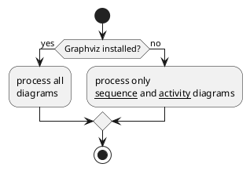

# Styles for Plantuml

## Examples

You can try all of the below examples on http://www.plantuml.com/plantuml 

### Sequence Diagram


```plantuml

!include https://raw.githubusercontent.com/bharatrajagopalan/plantuml-styles/master/sequence_diagram_skin.pu

c->d: lets eat
activate c
  activate d
    d->d: do i want to eat
    alt if d wants to eat
      d-->c: Yes- lets go
    else if d doesn't want to eat
      d-->c: naaah
      deactivate d
    end 
deactivate c
```

### Activity





### Flowchart 


```plantuml

!include https://raw.githubusercontent.com/bharatrajagopalan/plantuml-styles/master/activity_skin.pu

|A|
:test;

|B|

:test2;

|C|
:test3;
```


### Flowchart Ink theme


```plantuml

!include https://raw.githubusercontent.com/bharatrajagopalan/plantuml-styles/master/activity_skin-ink.pu

|A|
:test;

|B|

:test2;

|C|
:test3;
```
